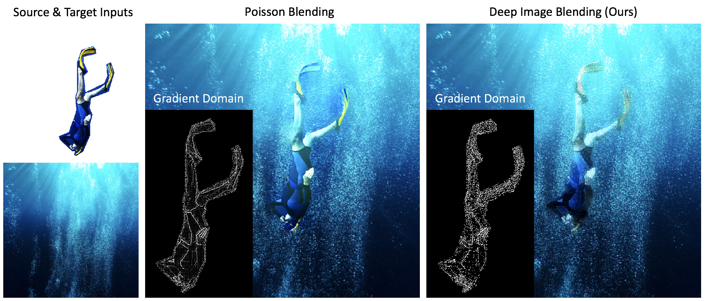

# Deep Image Blending
This is a Pytorch implementation of our paper "Deep Image Blending". 

[Deep Image Blending](http://openaccess.thecvf.com/content_WACV_2020/papers/Zhang_Deep_Image_Blending_WACV_2020_paper.pdf) <br />
[Lingzhi Zhang](https://owenzlz.github.io/), [Tarmily Wen](https://github.com/ChickenTarm), [Jianbo Shi](https://www.cis.upenn.edu/~jshi/)  <br />
GRASP Laboratory, University of Pennsylvania

In Winter Conference on Applications of Computer Vision (WACV), 2020

## Introduction

We propose a Poisson blending loss that achieves the same purpose of Poisson Image Editing. We jointly optimize the proposed Poisson blending loss with style and content loss computed from a deep network, and reconstruct the blending region by iteratively updating the pixels using the L-BFGS solver. In the blending image, we not only smooth out gradient domain of the blending boundary but also add consistent texture into the blending region.



## Usage
This project uses [poetry](https://python-poetry.org/) to manage dependencies; start by install poetry and then dependencies

```bash
pip install poetry
poetry install
```
Once this is done you can run the example. Please check the arguments in the code for you application. 

```bash
poetry run python run.py
# check arguments
poetry run python run.py --help
``` 

## Ablation Study


## Example results for paintings


## Example results for real-world images


## Citation
If you use this code for your research, please cite our [paper](http://openaccess.thecvf.com/content_WACV_2020/papers/Zhang_Deep_Image_Blending_WACV_2020_paper.pdf):

```
@inproceedings{zhang2020deep,
  title={Deep Image Blending},
  author={Zhang, Lingzhi and Wen, Tarmily and Shi, Jianbo},
  booktitle={The IEEE Winter Conference on Applications of Computer Vision},
  pages={231--240},
  year={2020}
}
```
